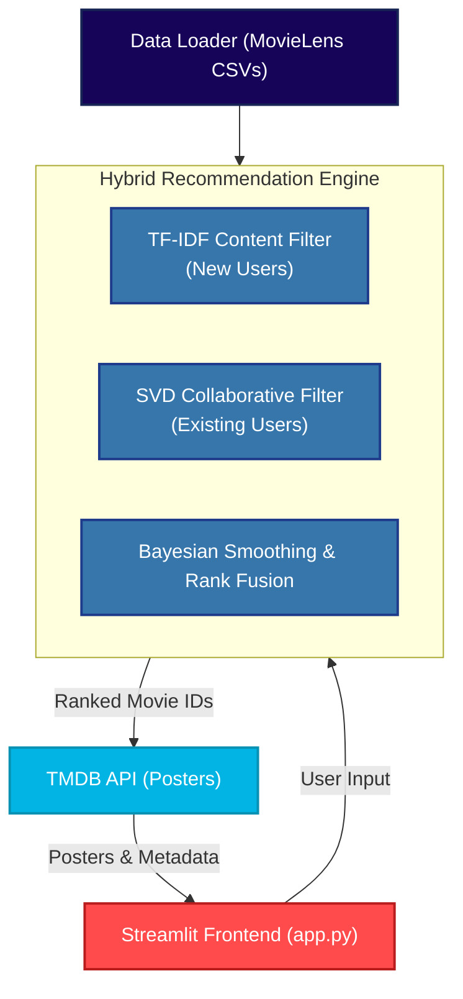

<div align="center">

<!-- HERO BANNER -->


<br /><br />

<h1>🎬 Movie Recommender System</h1>
<h3>AI-Powered Personalized Movie Recommendations</h3>

<p><em>An enterprise-grade hybrid collaborative and content-based filtering engine built with Streamlit and Python.</em></p>

<br />

<!-- BADGE ROW 1 -->
<p>
  
  
  
  
  
</p>

<!-- BADGE ROW 2 -->
<p>
  
  
  
  
</p>

<br />

<p>
  <a href="#-overview"><strong>Overview</strong></a> ·
  <a href="#-features"><strong>Features</strong></a> ·
  <a href="#-the-data"><strong>The Data</strong></a> ·
  <a href="#-mathematical-foundations"><strong>Mathematical Foundations</strong></a> ·
  <a href="#-architecture"><strong>Architecture</strong></a> ·
  <a href="#-getting-started"><strong>Getting Started</strong></a> ·
  <a href="#-deployment"><strong>Deploy</strong></a>
</p>

</div>

---

## 🌟 Overview

<a name="-overview"></a>

The **Movie Recommender System** is a sophisticated, production-ready web application designed to solve the common problem of choice paralysis when selecting a movie. Built entirely in Python using **Streamlit**, it provides highly personalized movie suggestions by utilizing a **hybrid recommendation engine**.

Recommender systems typically suffer from the **Cold Start Problem** (inability to recommend items to new users with no history). This system solves that by seamlessly switching between algorithms depending on user history:

- **For New Users (Cold Start)**: The system utilizes **TF-IDF Content-Based Filtering** to instantly analyze genre overlap and compute Cosine Similarity based on user input.
- **For Existing Users**: The system relies on **Singular Value Decomposition (SVD)** via Collaborative Filtering to predict what a user will rate unseen movies based on their historical rating matrix.

### Why this system?

| Traditional Recommenders | Our Advanced System |
|-------------------------|-------------|
| Struggles with new users | Uses **TF-IDF content filtering** for instant "cold start" recommendations |
| Basic popularity sorting | Applies **Bayesian average smoothing** to prevent obscure movies with single 5-star ratings from dominating |
| Text-only interfaces | Fetches dynamic, high-quality movie posters live via the **TMDB API** |
| Heavy, complex setup | Runs instantly via a lightweight, highly responsive **Streamlit** interface |

---

## ✨ Features

<a name="-features"></a>

- **Hybrid Filtering**: Best-in-class algorithmic switching between Collaborative and Content-Based models.
- **Bayesian Smoothing**: Statistically robust rating averages that prevent data skewing.
- **Real-Time Data Fetching**: Seamless integration with the TMDB API to pull rich metadata and high-res posters asynchronously.
- **Automated Data Loading**: Auto-downloads and parses the MovieLens dataset on first run.
- **Graceful Fallbacks**: If the `scikit-surprise` C++ library fails to install, the system automatically falls back to a pure `SciPy` SVD implementation.
- **Responsive UI**: Custom CSS gradients, hover animations, and a modern glassmorphism aesthetic built on top of Streamlit.

---

## 📊 The Data

<a name="-the-data"></a>

The engine is trained on the renowned **[MovieLens ml-latest-small](https://grouplens.org/datasets/movielens/latest/)** dataset, provided by GroupLens Research.

- **Movies**: ~9,700 unique films
- **Ratings**: ~100,000 user ratings
- **Users**: ~600 distinct users
- **Sparsity**: The user-item matrix is highly sparse (~1.7% density), which is precisely why matrix factorization (SVD) is incredibly effective here.

*Note: The dataset is automatically downloaded into the `/data` directory when you first run the application.*

---

## 🧮 Mathematical Foundations

<a name="-mathematical-foundations"></a>

Understanding the engine under the hood.

### 1. TF-IDF & Cosine Similarity (New Users)
When a user selects favorite genres, we convert the genre tags into a TF-IDF (Term Frequency-Inverse Document Frequency) matrix. This penalizes extremely common genres (like "Drama") and rewards specific, niche genres (like "Film-Noir").

We then compute the **Cosine Similarity** between the user's input vector and all movies in the database:
> $$ \text{similarity} = \cos(\theta) = \frac{\mathbf{A} \cdot \mathbf{B}}{\|\mathbf{A}\| \|\mathbf{B}\|} $$

### 2. Singular Value Decomposition (Existing Users)
For collaborative filtering, we decompose the User-Item rating matrix $R$ into three matrices using SVD:
> $$ R = U \Sigma V^T $$
Where:
- $U$ represents the latent feature matrix of the users.
- $\Sigma$ is the diagonal matrix of singular values (weights of latent features).
- $V^T$ represents the latent feature matrix of the movies.

By reducing the dimensionality, we filter out noise and predict missing ratings with high accuracy.

### 3. Bayesian Average Rating
To rank movies fairly, we apply a Bayesian Average. If a movie has a single 5-star rating, it shouldn't rank higher than a movie with 10,000 4.8-star ratings.
> $$ \text{Bayesian Average} = \frac{(v \times R) + (m \times C)}{v + m} $$
- $v$ = number of ratings for the movie
- $m$ = minimum ratings required (median across the dataset)
- $R$ = average rating of the movie
- $C$ = global average rating across all movies

---

## 🏗️ Architecture

<a name="-architecture"></a>



### Module Breakdown

| Module | Responsibility |
|--------|----------------|
| `app.py` | The main entry point. Handles Streamlit routing, custom CSS injection, and state management. |
| `data_loader.py` | Checks for local CSVs, downloads/extracts the MovieLens ZIP if missing, and calculates global stats. |
| `content_filter.py` | Houses the `scikit-learn` logic for TF-IDF vectorization and cosine similarity calculations. |
| `model.py` | Houses the `scikit-surprise` (and fallback `SciPy`) logic for SVD training and prediction. |
| `tmdb_client.py` | Manages external network calls to TMDB, implements local disk caching to respect API rate limits. |

---

## 💻 Getting Started

<a name="-getting-started"></a>

### 1. Clone & Setup

```bash
git clone https://github.com/lokojitcoder123/-Movie-Recommender-System.git
cd -Movie-Recommender-System

# Create and activate virtual environment
python -m venv venv

# Windows
venv\Scripts\activate     

# macOS/Linux
source venv/bin/activate  
```

### 2. Install Dependencies

```bash
pip install -r requirements.txt
```
> **Troubleshooting `scikit-surprise`**: This library compiles C++ extensions during installation. If you are on Windows and encounter an error, ensure you have the [Microsoft C++ Build Tools](https://visualstudio.microsoft.com/visual-cpp-build-tools/) installed. If you prefer not to install them, the app will safely fall back to the native `SciPy` implementation.

### 3. API Key Configuration (Required for Posters)

To display beautiful movie posters, you need a free API key from TMDB.
1. Sign up for a free developer account at [The Movie Database (TMDB)](https://www.themoviedb.org/signup).
2. Navigate to **Settings > API > Create > Developer**.
3. Copy your `.env.example` file to `.env`:
   ```bash
   cp .env.example .env
   ```
4. Paste your `TMDB_API_KEY` into the `.env` file.

### 4. Run the Application

```bash
# Standard Launch (Port 8501)
streamlit run app.py

# Custom Port Launch (e.g., Port 8502)
# Windows users can double click the provided batch file:
run_port_8502.bat
```

---

## ☁️ Deployment

<a name="-deployment"></a>

This application is ready to be deployed on **Render** as a Web Service.

1. Log into your Render dashboard and click **New +** -> **Web Service**.
2. Connect your GitHub repository.
3. Configure the environment:
   - **Runtime**: `Python 3`
   - **Build Command**: `pip install -r requirements.txt`
   - **Start Command**: `streamlit run app.py --server.port $PORT --server.address 0.0.0.0`
4. Add your `TMDB_API_KEY` under the **Environment Variables** tab.
5. Click **Deploy**.

---

## 🛣️ Future Roadmap

- [ ] **Deep Learning Integration**: Upgrade the SVD model to Neural Collaborative Filtering (NCF) using PyTorch or TensorFlow.
- [ ] **Real-Time Retraining**: Allow the model to update weights dynamically as users interact with the app.
- [ ] **Enhanced UI**: Add movie trailers and cast information to a detailed modal view when a movie poster is clicked.
- [ ] **Hybrid Weighting**: Allow users to adjust a slider that determines the weight between content similarity and collaborative popularity.

---

## 🤝 Contributing

Contributions make the open-source community an amazing place to learn, inspire, and create. Any contributions you make are **greatly appreciated**.

1. Fork the Project
2. Create your Feature Branch (`git checkout -b feature/AmazingFeature`)
3. Commit your Changes (`git commit -m 'Add some AmazingFeature'`)
4. Push to the Branch (`git push origin feature/AmazingFeature`)
5. Open a Pull Request

---

<div align="center">
  <br />
  <strong>Movie Recommender System</strong> — Built with ❤️ by <a href="https://github.com/lokojitcoder123">lokojitcoder123</a>
  <br />
</div>
